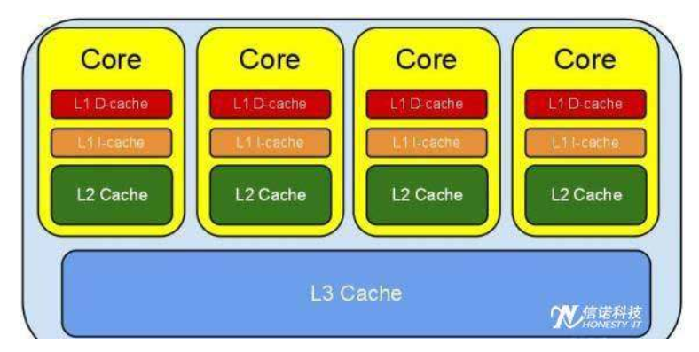

# cpu缓存和内存屏障

- 每个cpu都有自己的缓存
  - 一级缓存
  - 二级缓存
  - 三级缓存

- 各大CPU厂商定义了MESI协议

ps:单个CPU对自己的缓存中的数据进行改动，需要通知给其他cpu

- 运行时指令重排
  - 指令重排的意义: 写缓存指令执行时发现l3被其他CPU占用，先执行读缓存的指令
  - as-if-serial:不管怎么重排序，运行的执行结果不能被改变

- 写内存屏障（store memory Barrier）
  - 在指令后插入store barrier,能让写入缓存中的最新数据更新写入主内存（cpu必须等写完才执行其他语句，而不能去指令重排序，先执行其他后面读内存的语句），让其他线程可见
- 读内存屏障
  - 在指令前插入load Barrier,可以让告诉缓存中的数据失效，强制从新主内存加载数据。强制让指令读主存的内容而不是缓存

