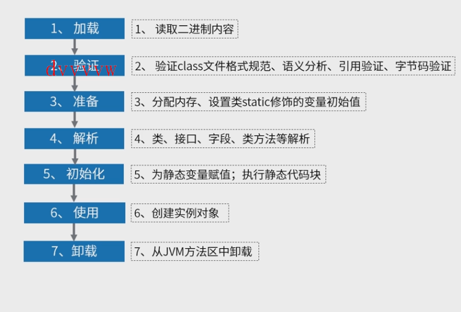

类的生命周期

类加载器

搜索网络、jar、zip、文件夹、二进制数据、内存等指定位置的类资源。一个java程序运行，最少有三个类加载器实例，负责不同类的加载

- Bootstrap loader(核心类库加载器)

  

- Extension Class Loader

- 应用程序加载器

- 自定义的子类加载器
  - 给定类所在位置
  - 指定父加载器的加载器名称（没有也没事）

1. jvm如何知道我们的类在哪个位置

(每个加载器先读取目标类的路径（配置项）)

> jps查看在跑的java进程
>
> jcmd pid -help 查看相应进程的一些信息（如程序相关配置文件所在位置）

2. 类的卸载

- 该类所有的实例已经被GC

- 加载该类的ClassLoader实例已经被GC

idea vm option加一句：-verbose:class(类加载和类卸载日志信息显示)

3. 双清委派

双亲委派：败家子自己不先做，先让上级试试加载，上面不行我再加载

双亲=上下级

委派：上级收到下降报告希望上级加载，上级没加载成，委派给下级加载

防止重复加载，上下级加载区分