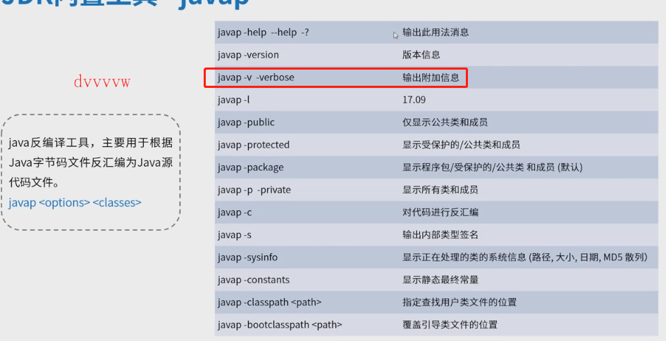
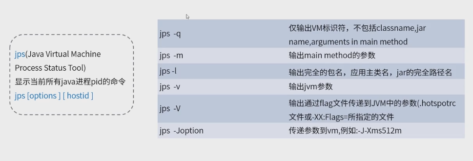
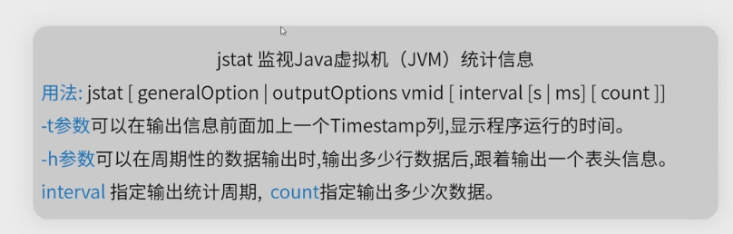
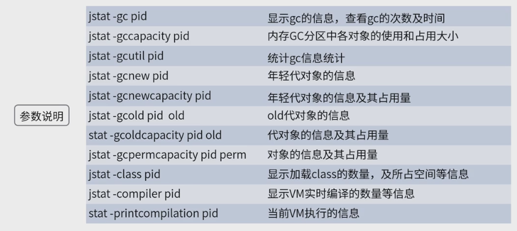
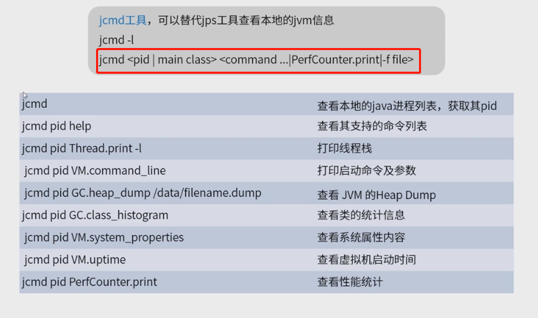
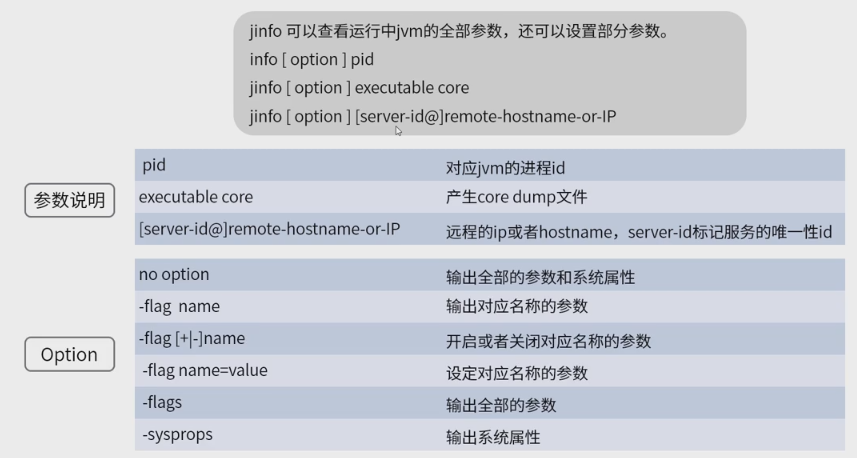
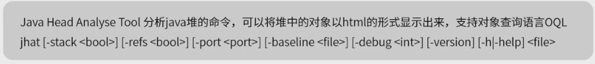
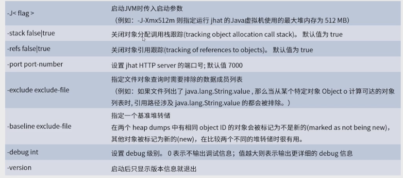
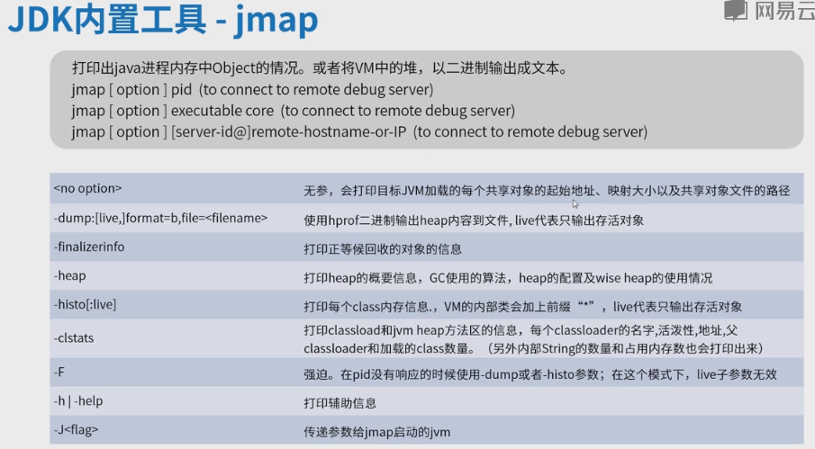
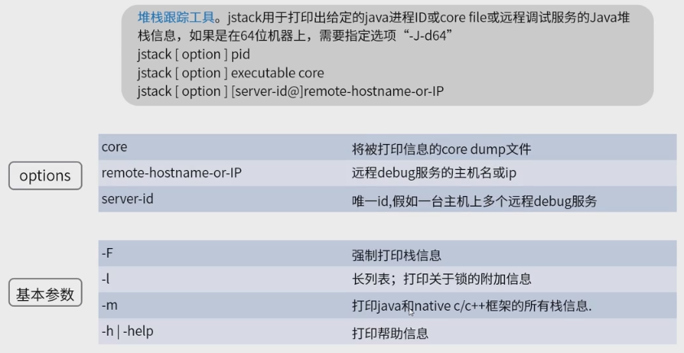

 https://docs.oracle.com/en/java/javase/13/ 

尽量使用可视化工具，而不是依赖工具

**jvisualVM：jdk内置工具**：实用程度：5星

**jconsole可视化工具**：一般

javap:

常用的是javap - v +<classes>

**jps:**

**jstat** 实时监控

jcmd: 替代Jps工具

jinfo

jhat

jmap

jstack

