**什么是引用**：

​	程序 的某些部分仍然维护了指向该对象的指针，引用是**针对指针**而言

> 引用也有很多种，其实应该都是指针，只不过通过指定不同引用类型来表示**被引用对象**在jvm视角上的不同，jvm根据指针的不同类型在GC时进行不同的判断

- 强引用（b a=new b()）

- 软引用（缓存） Jvm二次gc到软应用的对象时，就会gc它，第一次不会

- 弱引用，虽然是引用，但随时可能被回收
  - ThreadLocalMap防止内存泄漏  
  -  监控对象是否将要被回收 	

- 虚引用（可以用来做对象监控，查看对象是否还在内存中），不能通过引用访问对象，比如 jvm在GC的时候需要执行代码finalize指定的操作，要找到对象就要用到虚引用

**可达性级别**：

可达性是针对被引用对象而言

ps：虚引用也叫幻象引用

**Gc的三个步骤**

1. 确定哪些对象需要被回收（打扫卫生，先确定哪个地方比较脏）

   - 标记

     - 引用计数：会产生循环引用问题
     - 可达性分析（顺藤摸瓜）
       - 可以作为GC root的对象
         - 虚拟机栈中正在引用的对象
         - 本地方法栈中正在引用的对象
         - 静态属性引用的对象
           - **静态属性引用了某个对象（依赖注入到这个属性）**
         - 方法区常量引用的对象

     

2. 确定什么时候需要被回收

3. 确定怎么回收

   1. 标记-清除：容易引起内存碎片化

      PS：以下两个算法都是对1的改进

   2. 复制算法 （再保存一块内存，将原空间还活着的对象复制到新空间，清空原空间，在下次标记时，原空间相对于现在的空间就是新空间):内存浪费

      
   
   3. 整理算法:挪动一下
   
      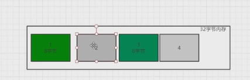
   
      先清除完2-4，再整理	

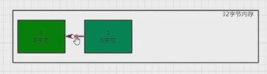

根据对象的存活周期，将内存划分为几个区域，**不同区域采用不同的垃圾收集算法**，**都是先标记**

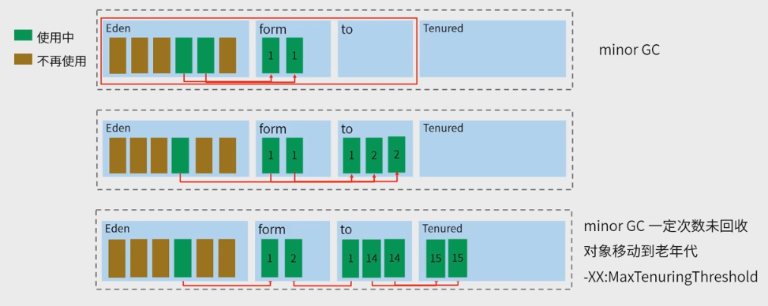

Eden还用的在下一次GC被安排到from（复制算法），from在下一次GC还需要使用的被安排到to，同理to被安排到tenured,

也可以设置 **-xx:+pretenureSizeThreshold,**大对象直接进入老年代

>  hotspot 的内存结构
>
> 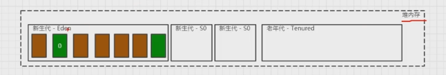
>
> 新生代(占总内存33%)
>
> - Eden（占新生代80%）
> - from（占新生代10%）
> - to(占新生代10%)
>
> 老年代（占总内存66%）
>
> 在一定时刻，from(s0)和to(s1) 两个区域是相对的，(使用标记-复制算法)相互挪来挪去，清理来清理去，当对象被挪的次数达到一定次数，对象就会被放到老年区，
>
> ps:当s1作为from，Eden中在标记过程中还活着的对象就会放到s1而不是就近的s0

**-xx:MaxTenuringThreshold** 

设置最大挪的次数

垃圾收集器

**stop-the-world** ：用户的代码，用户的线程先不动

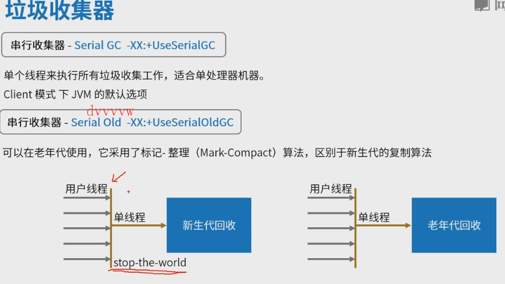

**串行收集器**：（使用比较少，物联网设备）

- 使用标记-整理算法

  不能一边用户线程生成垃圾，一边GC线程清除垃圾

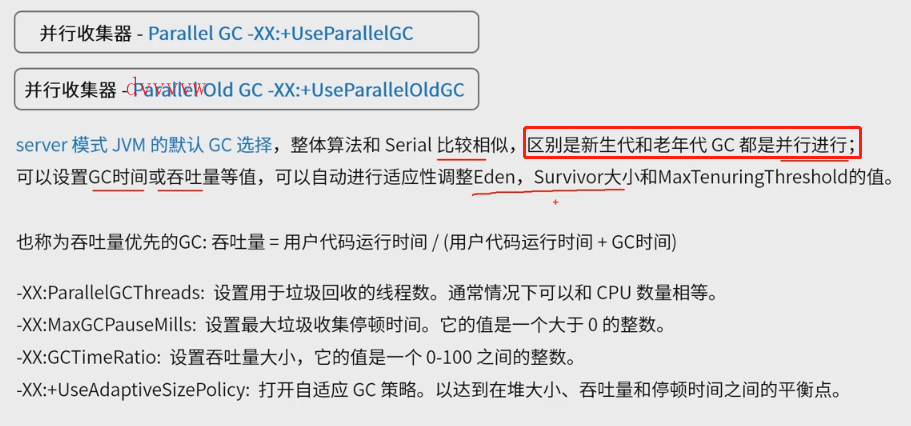

**并行收集器**(并行)：仍然不能一边生产垃圾一边清除垃圾，只是新生代和老年代的gc可以分开并行操作，多了一些自定义设置。

吞吐量中的用户代码运行时间设置为99%，GC时间设置为1%这一类的

针对老年代gc的垃圾收集器：

​	cms

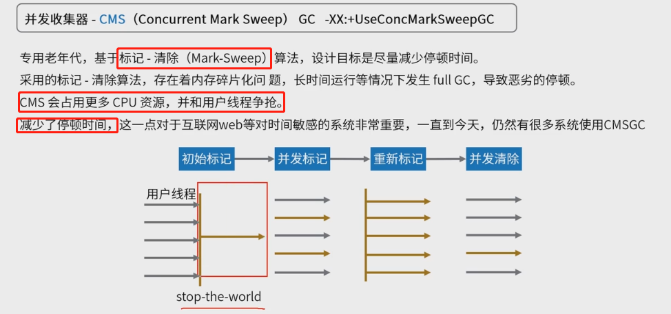

并发收集器（并发）（一边充电一边玩收集）：多次标记，但是第一次是单线程的，后面几次是并发标记（颜色不同的是用户执行代码的线程），减少了标记时间，但是也在这一时间段占用更多的cpu资源，

针对新生代gc的垃圾收集器：

​	ParNewGc:

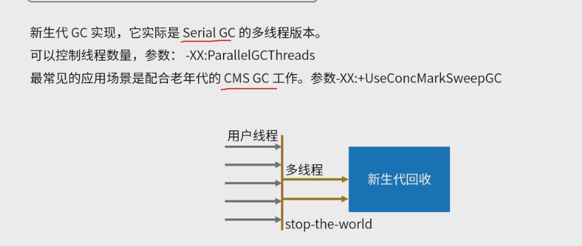

cms收集器的替代品

G1

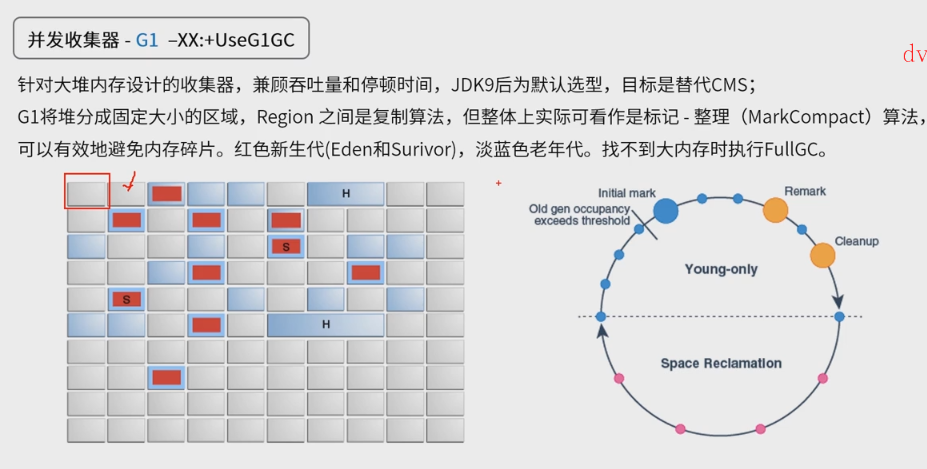

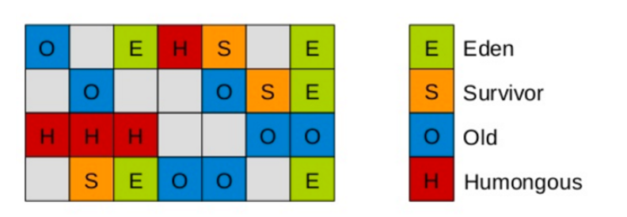

圆圈都是暂停，黄色表示整理、新生代整理等，蓝色表示新生代标记，粉红色表示混合标记整理（新生代+老年代）

选择，一般paralle scavenge+parallel old一组 ，g1一组，parNew+CMS一组这3种

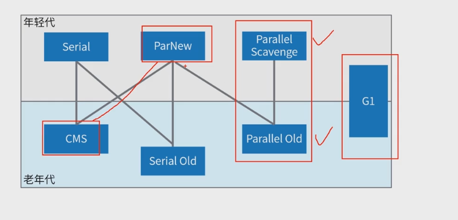

