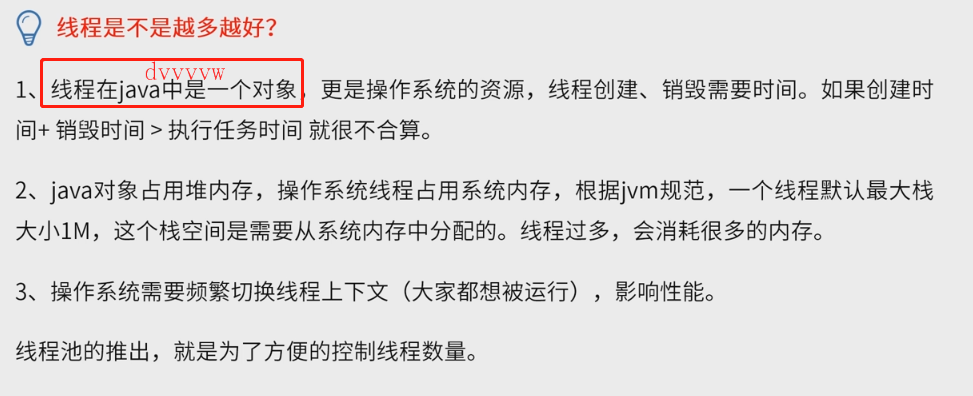
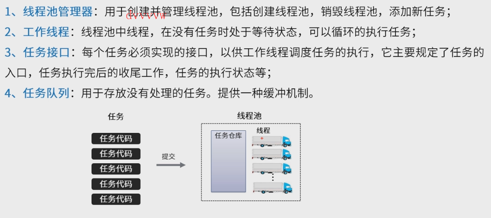
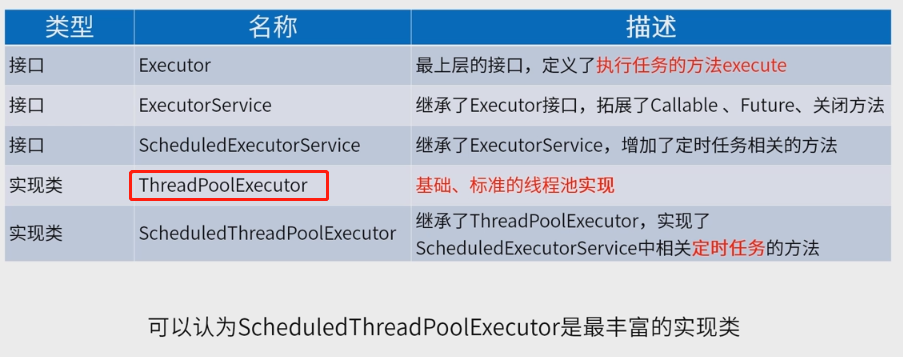
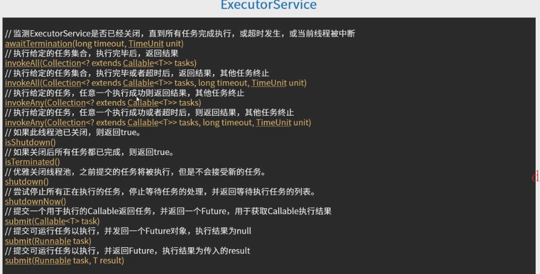
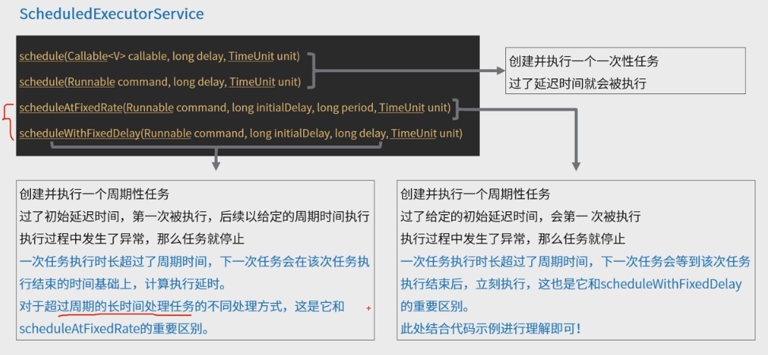
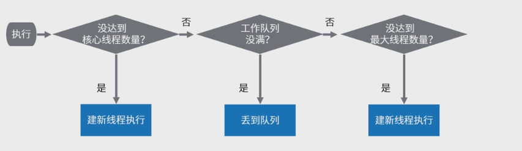
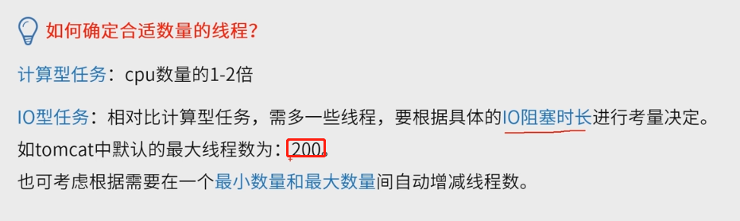

线程池为了控制线程数量

线程池原理（主要看图）

重点是红圈这个实现类

左右两边都这个每隔1秒钟执行1个需要耗时3秒的任务，

> 10：01开始执行任务1
>
> 10：02想开始执行任务2，但是任务1没执行完，放到队列
>
> 10：04任务1执行结束
>
> 10：05 取出任务2开始执行（而右边方法是在10秒04第一个任务结束直接执行任务2，一般用右边方法）

往线程池不断提交任务，，当核心线程有空闲时，直接将任务交给核心线程执行，当核心线程没有空闲的线程，如果线程池的任务队列没满，那么线程池不会创建新的线程直至线程数量到达预先设置的线程池最大线程数，而一直维持核心线程数的n

如果队列满了，尝试创建新的线程（这些线程5秒没活干会被杀掉），当创建的线程数目达到上限（上限有指定的话），

那么再提交任务会使用拒绝策略

缓存线程池

> 任务大小不太好控制时适合使用，相当于任务队伍不负责存任务，只负责接任务并为其创建一个线程。最大线程数量可以给一个非常大的值(线程池达到最大线程数量会咋样？)

核心线程数为0，新任务来就新建一个线程服务消费任务，线程执行完任务会等待一定时间（可自定义设置）再自动销毁

定时线程池：

有个延时队列，到了时间点才能往里面取任务

周期线程池（两种）：

任务不会交叉执行，一定是上一次任务执行完才会每隔一定时间（可以为0，）继续执行下一个任务

终止线程池有两种

- 老任务消耗完再自动关闭 shutdown()
- 立刻关闭 shutdownnow()

80%CPU被认为是充分利用