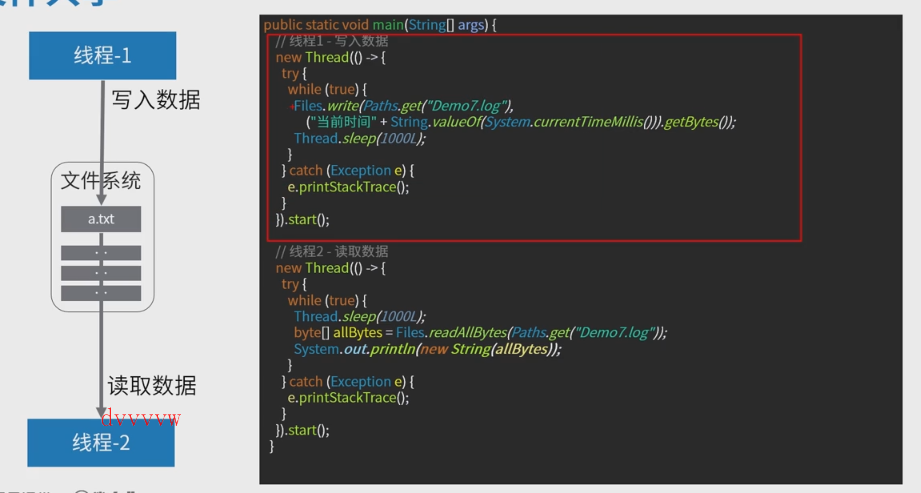
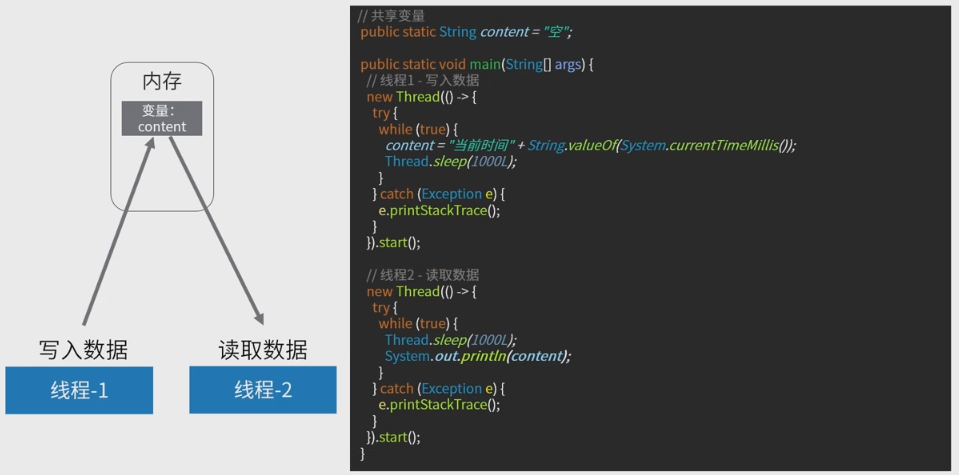
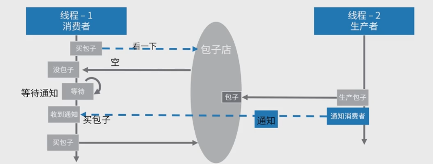
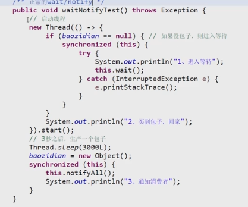
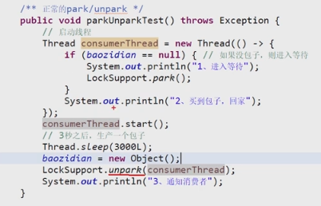
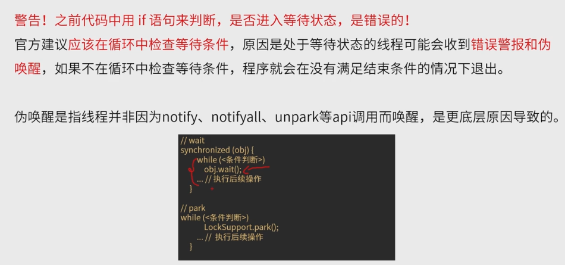

1）文件共享

​		

2）网络共享

3）共享变量

4）jdk提供的线程协调API（**重点**）

- wait/notify
- park/unpark

生产者消费者模型

**生成线程类，启动它，等待，条件成熟开始**

1. wait/notify:

- 两个接口的调用需要拥有同一对象锁的线程调用

  - 相当于用同一个锁，线程执行wait后，会挂在锁的监视器中

- wait会自动解锁（交出锁（对象锁（synchronized(this)）））,然后进入等待，等收到notify信号，

   会去尝试从新获得锁，获得成功了就继续执行代码，不成功就不执行代码

​		

2.park,unpark

LockSupport.park()（停车检查，等待许可证发放）

LockSupport.unpark() 发放许可证

许可证变量只有0，1相当于互斥，多次unpark并不会累加

注意unpark、park不应该有监视锁(挂到锁的等待队列中)，因为park不像wait会交出同步锁，

**伪唤醒**

相当于底层唤醒了wait的线程，又尝试跑了一遍线程，这时候会跳出if(){}循环，继续往下执行。if()只是条件判断，并不能卡住代码